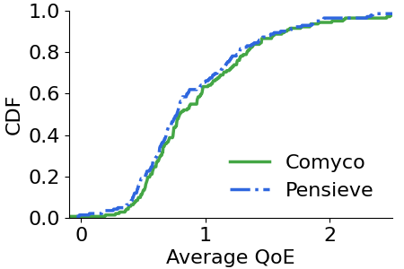
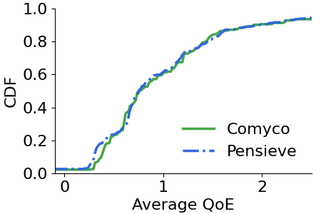
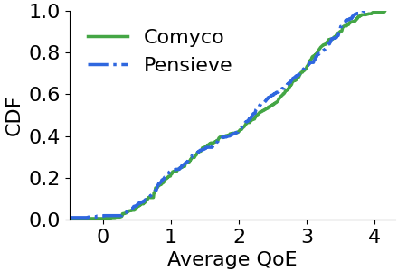

# Comyco for linear-based QoE

This is an official implmentation of Comyco for QoE$_{lin}$. Compared with the orignal Comyco, we made several changes here.

- *Instant solver*: we upgrade the "MPC-based solver" to "Beam-search solver", which extend the future look horizon to **15** (default: 8). In other words, by leveraging beam search technologies, Comyco can obtain more precise expert strategies with lower execution costs.

- *Discounted bandwidth*: Considering that Comyco sometimes tends to pick higher bitrates due to the almost omniscient Instant Solver, we integrate a discount factor of 0.9 for computing bandwidth. This has proven to be effective in helping Comyco avoid rebuffering events.

- *Neural network*: For the sack of fairness, Comyco's neural network is aligned with the Pensieve's.

- *Loss function*: We adjust the weight of entropy to 0.1 for reducing exploration. Note that this differs slightly from the description in the original paper.

# Build by yourself

We use pybind11 to implement beam-search solver. To install it please do the following steps:

```
pip install pybind11
cd cc
sh build.sh
```

The pre-build version was built using Python 3.7.9, and runs on Ubuntu 20.04.

# Train Comyco

Just type 

```
python train.py
```

if you have already installed *Tensorflow, TFlearn and tqdm*.
You can monitor the learning process during training using Tensorboard. We have saved one of the training logs in the *./logs/* directory.

# Test Comyco

Just type

```
python test.py path_to_your_model
```

to test the trained model. Here we provide a pretrained model in 

```
python test.py pretrained/model
```

# Evaluation

plot the figure using

```
pip install matplotlib
python plot.py
```

Results are reported in 'imgs/cdf.png'. As shown, Comyco improves the average QoE of 6.5\% compared to Pensieve.


<p align="center">
    
</p>
<p align="center">
    <em>HSDPA</em>
</p>
<p align="center">
    
</p>

<p align="center">
    <em>FCC</em>
</p>
<p align="center">
    
</p>

<p align="center">
    <em>Oboe</em>
</p>